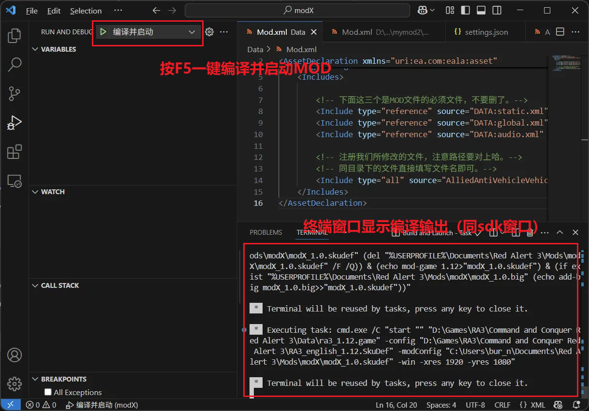
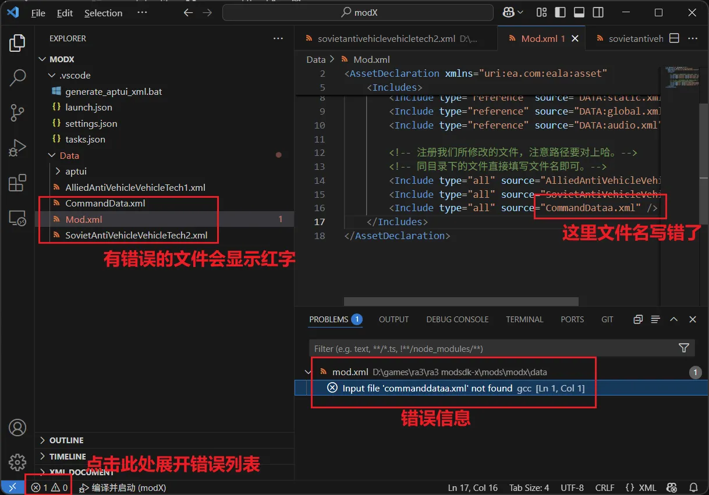

### 红警3 MOD 制作 —— vscode 编译流程文件

##### 特色介绍

1. 修改代码、编译mod、启动游戏，全部集成在一个vscode窗口里面！一键调试！
2. 相比sdk的编译窗口：不会闪退，不会抽风一直弹“参数值必须为正”，可以随时中断编译，不会紫字
3. 快速定位报错的文件

##### 使用说明

1. 将本项目中的`.vscode`文件夹放进你的mod根目录
2. 编辑`settings.json`，调整设置
3. 在vscode中打开mod文件夹
4. 在“调试”侧边栏里面会出现四个调试选项：

* 编译并启动。等价于SDK里的1 3 4 5 6 7 8 9 10  
* 清理、编译并启动。等价于1 2 3 4 5 6 7 8 9 10  
* 编译选项：45678910。跳过清理和aptui，可以加快一些速度。如果只是修改了单位xml，需要快速看看效果，可以用这个。  
* 直接启动。直接启动游戏并加载mod。  

5. 改完代码，按下F5，一键调试，轻轻松松！
6. 如果不想启动游戏，也可以按Ctrl+Shift+B，仅编译。
7. 如果想自定义编译流程，也可以自行修改`tasks.json`文件

> 注1：mod源代码的存放位置、编译出来的mod文件位置均和sdk相同  
> 注2：本项目不提供编译本身所需的exe文件，因此仍需要安装sdk、安装mod地编。 

##### 效果展示

